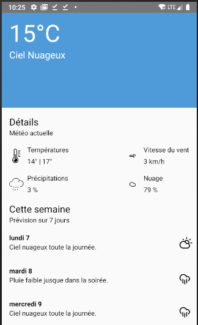

# Weather

Timebox: 4h de code et 15/20 minutes de rédaction du README.
Je suis loin d'avoir fini tout ce que j'avais envie de faire mais je pense que c'est assez pour évaluer le niveau.

## Application

Elle est trés simple, affichage des données métérologique en haut et en bas les prévisions sur 7 jours

## Architecture

Architecture modulaire sous un pattern MVVM.

Les différents modules sont :
 - Today et Weekly contienent l'interface UI
 - TodayViewModel et WeeklyViewModel sont les VM du pattern MVVM
 - Repository est le module qui choisis quel datasource, dans quel ordre et si il faut refresh les données
 - LocalDataSource et RemoteDataSource: c'est les repository pour l'accés au données

Les patterns utilisé dans l'app:
 - MVVM qui est l'architecture principale du projet
 - L'utilsation des données unidirectionnel et des states, un seul flux du ViewModel vers la vue. Plus facile à debugger et dans l'air du temps avec Jetpack / MVI.
 Pour les state, c'est fait 1/2, on peut encore creuser le truc et améliorer cette partie.
 Inspiration des talk de Christina Lee <3 (KotlinConf 2018 - Representing State: the Kotlin Edition by Christina Lee)
 - Une activité et plein de fragments car c'est les recommendations
 - Coroutine et "Structured concurrency". Inspiration du talk de Roman Elizarov (https://www.youtube.com/watch?v=Mj5P47F6nJg)

## Idées d'amélioration fonctionelle

 - Avoir un systéme de rafraichissement avec pull to refresh
 - Changer le bandeau en fonction de la météo actuelle
 - Avoir un message d'erreur quand pas de connexion
 - Avoir un systéme de rafraichissement des données en background
 - Utiliser la géolocalisation pour connaitre la météo locale
 - Intégrer l'app avec Google Assistant

## Idées d'amélioration technique

  - Partir sur du vrai git flow et pas sur un initial commit :p désolé, mais j'avais pas le temps.
  - Des dépendences dans les build.gradle ne sont variabilisé
  - Variabiliser et utiliser les styles pour les dimensions dans les layouts
  - Passer les modules Today et Weekly en Dynamic delivery
  - Faire des tests d'intégration pour le module Weekly
  - Certaine classe de test aurait mérité d'être déplacé dans un module commun de test
  - Activer proguard
  - Avoir une vrai intégration continue

## Tests unitaires et d'intégration

Les tests d'intégration sont dans le dossier sharedTest des différents modules comme par-exemple celui de Today.
Depuis les nouvelles versions majeures de Robolectric, on peut utiliser la syntaxe espresso.
Les stoker dans sharedTest permet de partager les tests entre Robolectric pour les lancer dans la JVM et les tests Espresso pour les lancer sur un device.

Comme pattern pour les tests, je suis resté dans le simple avec le pattern Robot pour séparer le Quoi du Comment.
Je suis beaucoup inspiré de [cette conférence de Jake Wharton](https://jakewharton.com/testing-robots/).

Sinon les autres modules, "viewmodel", "repository" et "datasource" ont des tests d'intégration simple ou des tests unitaire quand le module est en kotlin sans dépendences vers kotlin.
 
